# 03 Frontend

## Awesome or overkill

---

# How work the web

---

## What is a browser

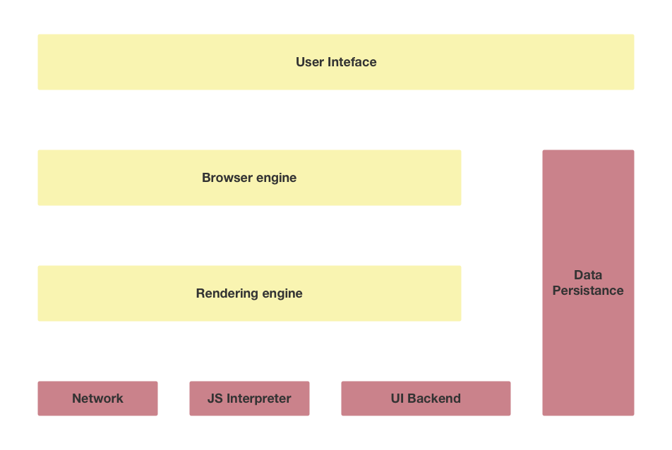

^ User Interface (Window / Bookmarks / Etc)
^ UI Backend (external widgets)
^ Networking (HTTP / HTTPS)

---

### Javascript Engine

Javascript interpreter

- SpiderMonkey
- JavascriptCore
- Chrome V8

^ SpiderMonkey: Mozilla
^ JavascriptCore: Apple
^ Chrome V8: Google, know thanks to NodeJS and Electron

---

### Data Storage

- localStorage
- IndexedDB
- WebSQL
- FileSystem

^ IndexedDB: A KV Store on the browser

---

### Browser & Renderer Engine

HTML + CSS Renderer

- Gecko/Quantum
- Wekkit
- Blink

^ Quantum is the new name of project that include Servo/Stylo/etc (Rust component)
^ Webkit the Apple's renderer engine
^ Blink is a fork of Webkit made by Google

---

^ 1. The engine receive data by chunk of 8Kb. If one rootNode is complete The process start
^ 2. Create the DOM
^ 3. Update positions of element according to the layout
^ 4. Apply CSS

---

## What is DOM

---

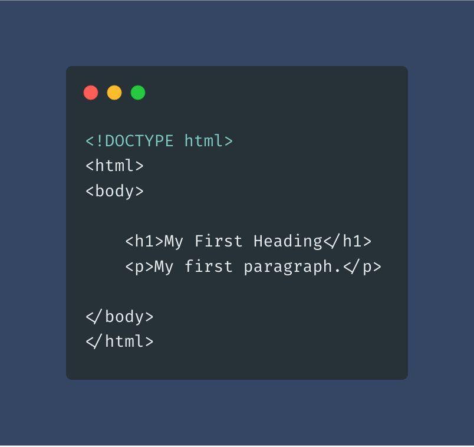

^ Not DOM, this is HTML

---

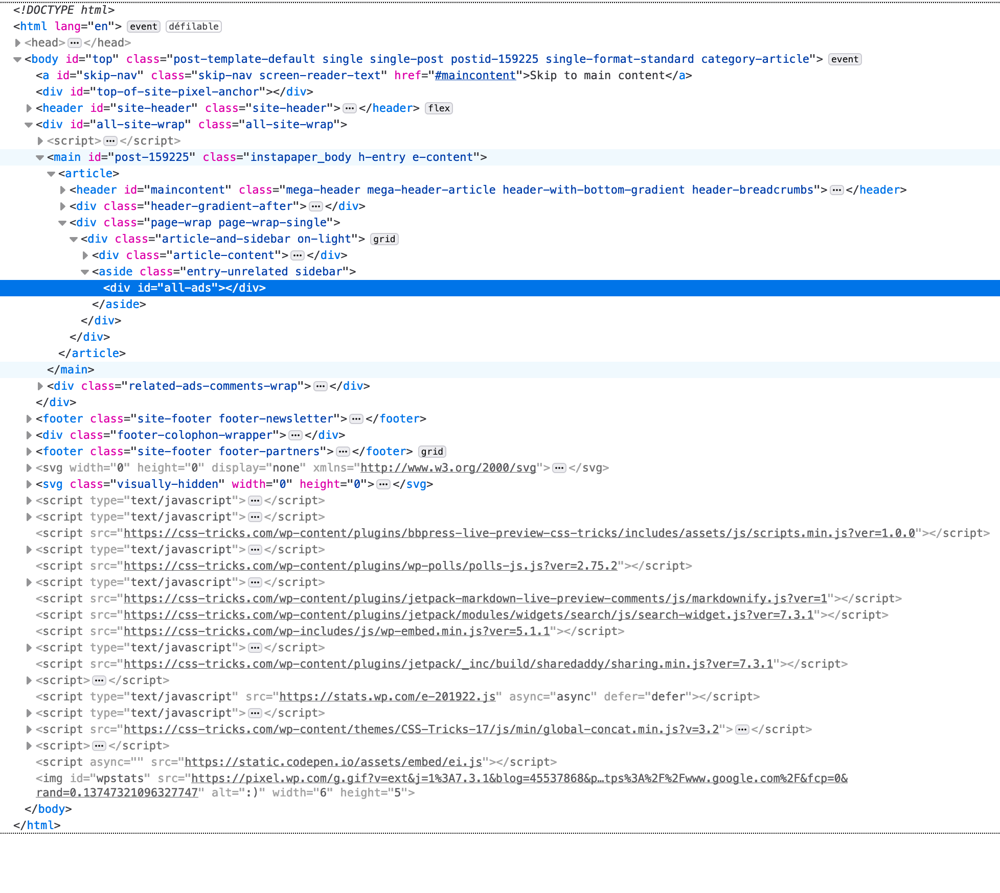

^ Can only be visible with "Inspect Element tool"

---

HTML > DOM

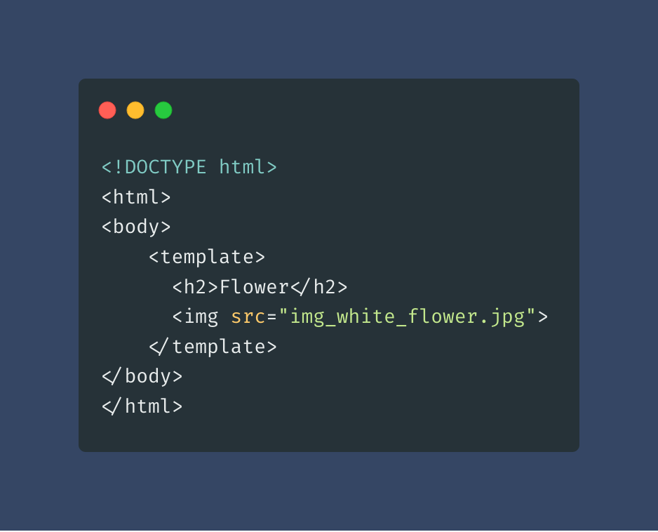 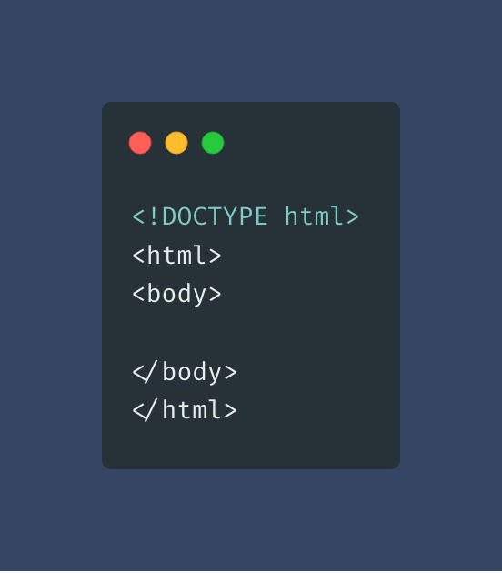

^ The template is not seen by the web renderer. It should be use by javascript.

---

DOM API

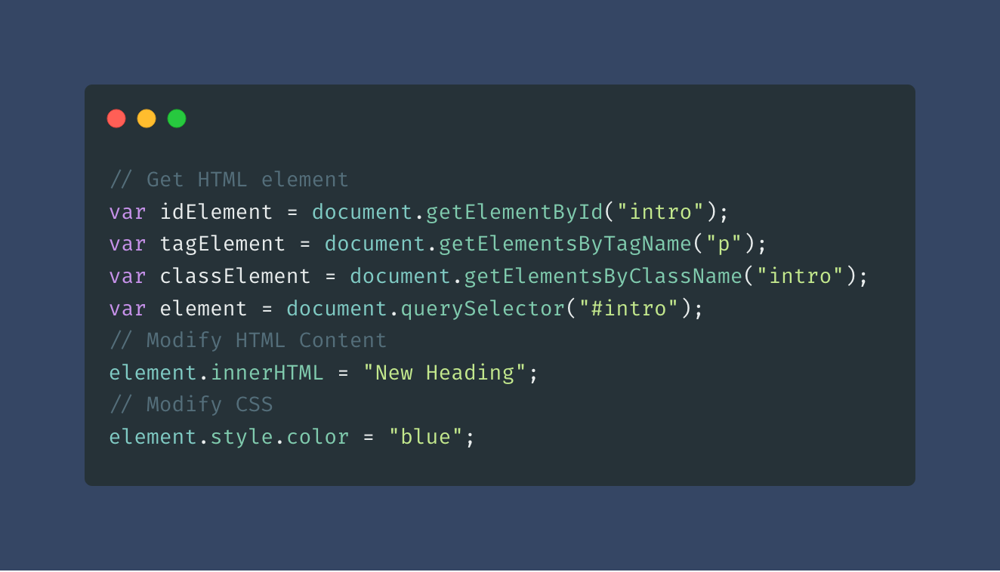

---

JQuery

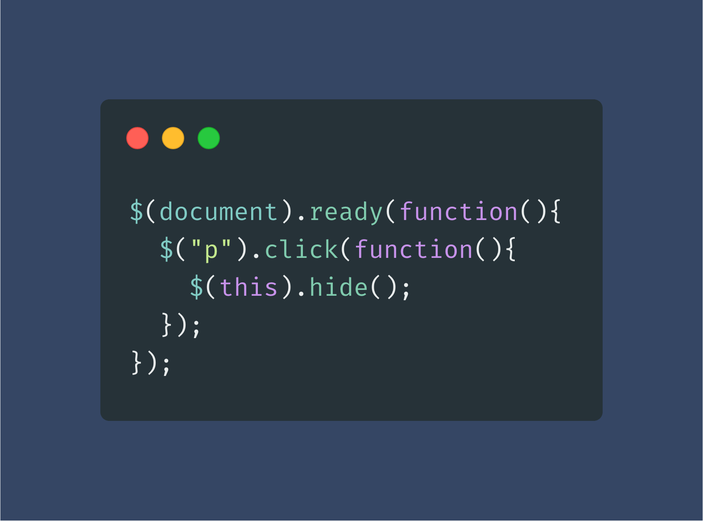

---

## What is Shadow DOM

---

[Example](https://jsfiddle.net/bfntoh2p/23/)

---

## What is Virtual DOM

---

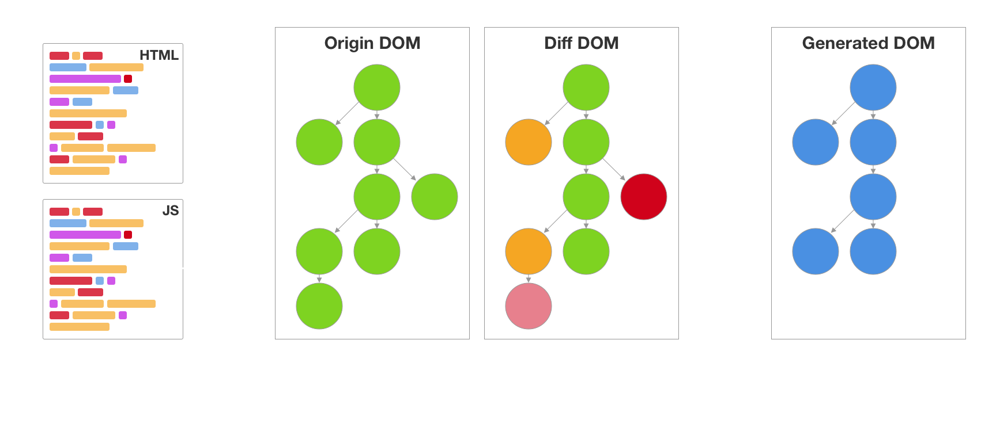

---

# Frameworks

---

## Angular

---

- Created by a google engineer for making internal google project
- 2010: The birth of AngularJS
- 2014 — 2015: The Great Rewrite
- 2016: The Panic Period
- 2017 — 2018: Emerging from the rubble
- Now Version 7

---

- Framework
- Shadow Dom
- Architrecture MVC
- 2 way data-binding
- Dependency injection
- Routing
- Testing

---

### Basics

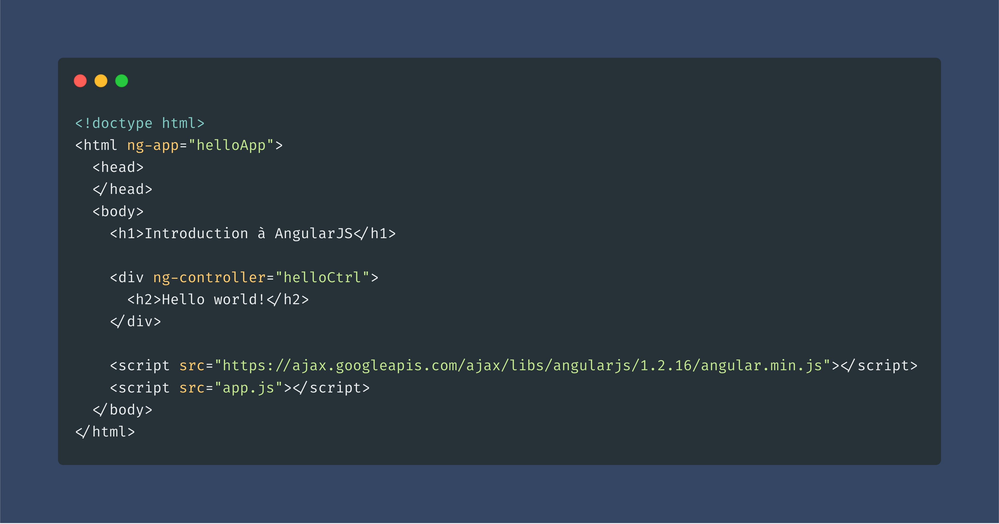

---

### Controller

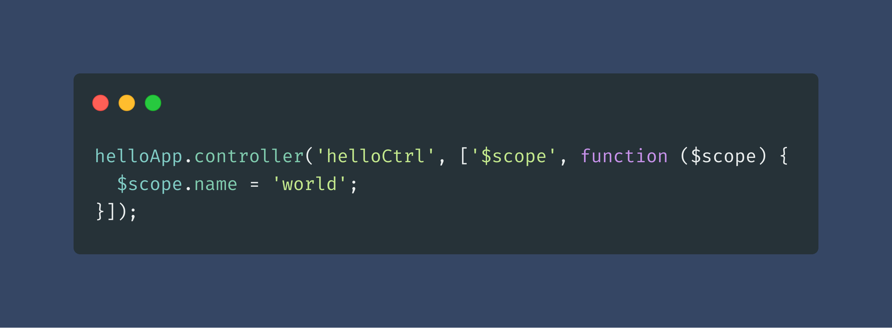 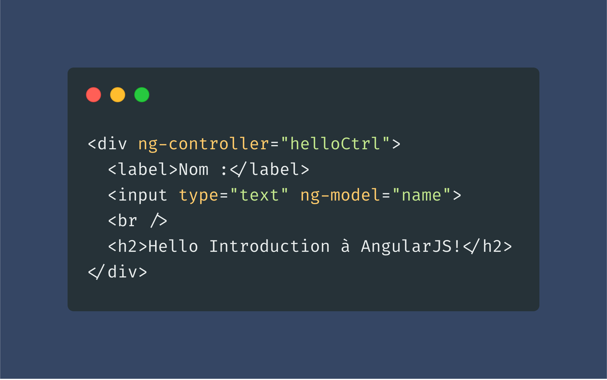

---

### Directives

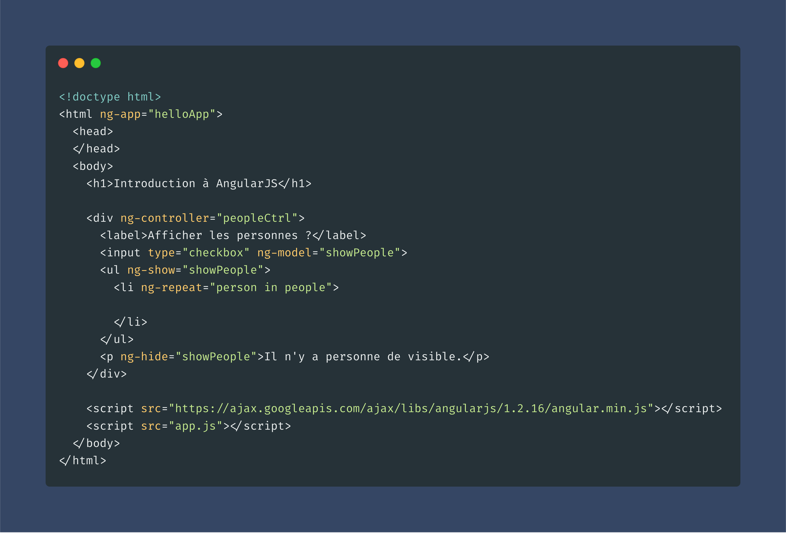

---

### Routing (HTML)

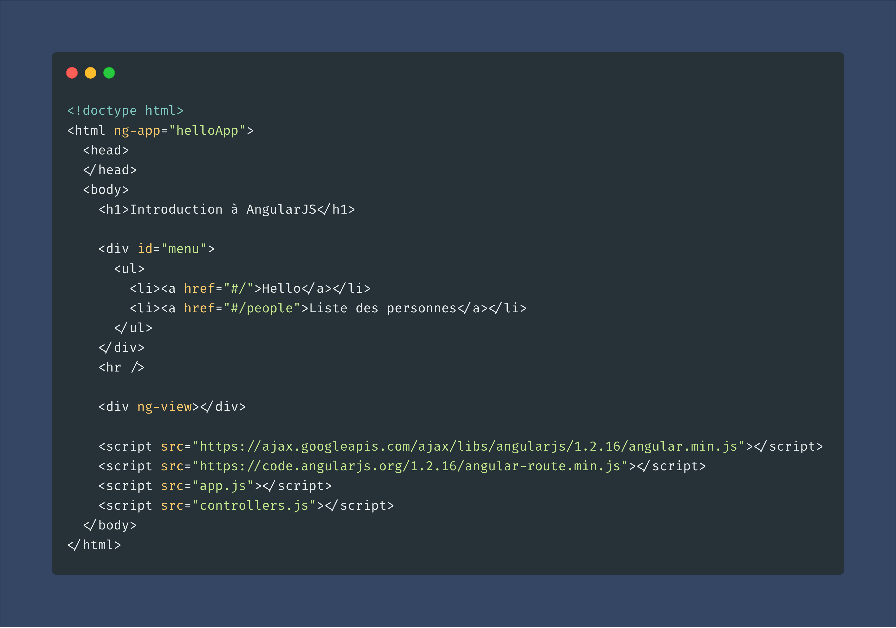

---

### Routing (JS)

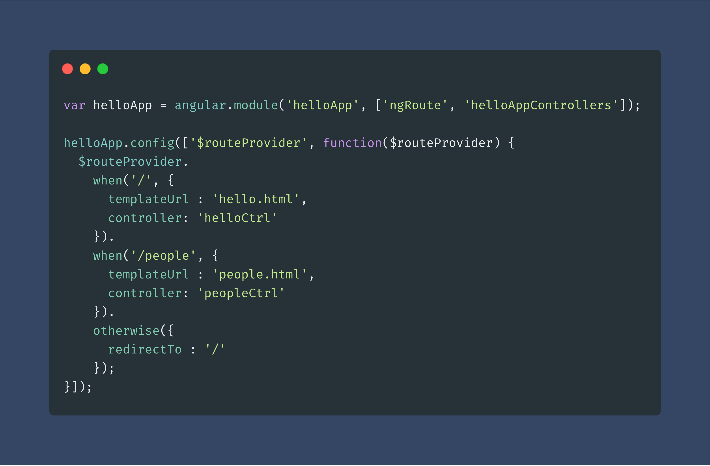

---

## VueJS

---

- Library
- Virtual DOM + Shadow DOM
- Component based
- HTML syntax
- Easy to learn

---

---

- VueX
- VueRouter

---

Tooling

- [Nuxt.js](https://fr.nuxtjs.org/)

---

## React

---

- Library
- Virtual DOM + Shadow DOM
- Component based
- JS syntax
- Not easy to maintain

---

- Redux
- reactive flow

---

Tooling

- [React Native](https://facebook.github.io/react-native/)
- [Preact](https://preactjs.com/)
- [Next.js](https://nextjs.org/)
